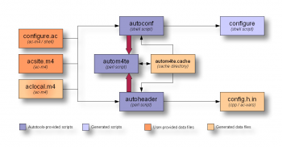

## Autotool 概述##

### autotool 工具概述 ###
    
- autotools工具主要有如下3个package
    - Autoconf
    - Automake
    - Libtoolize
    
  Automake and Libtool are both standard pluggable options that can be added to configure.ac with a few simple macro calls.

- Autoconf
    - Autoconf主要用来生成configure脚本的。

        > 附：configure脚本主要功能是以Makfile.in和config.h.in模板为输入
        > 
        >    基于系统特征和用户指定配置生成Makefile和config.h的。

    - autoconf的输入：configure.ac和acinclude.m4/aclocal.m4    
      autoconf的输出：configure脚本

    - Autoconf的package包含如下工具
        - autoscan : 扫描工程文件，帮助生成configure.ac
        - autoheader : 以configure.ac中(AC_CHECK_HEADERS等)为输入，帮助生成config.h.in
        - ifnames：如果没有autoheader自动生成config.h.in，那么借助此命令可以协助人肉写config.h.in
        - autoconf：将configure.ac中的宏展开，生成configure脚本。这个过程可能要用到aclocal.m4、acinlude.m4、 m4/*.m4中定义的宏。
        - autom4te: Autoconf package运行的缓存
        - autoupdate
        - autoreconf：
    
    - AutoConf package执行时的数据流图     
     
     http://www.freesoftwaremagazine.com/files/nodes/2754/autoconf_ahdr_dataflow.png
     
    - autoscan
        - 扫描整个目录，生成configure.scan文件，由此为基础人肉加工成configure.ac就比较方便了
        - autoscan生成的configure.scan内容依据一些规则：
            - 如果源码中有include，那么会添加AC_CONFIG_HEADERS, AC_CHECK_HEADER
            - 如果源码有C、C++, 那么需要添加编译工具的检查,比如：C_PROG_CC
            - 如果Makfile.in或Makefile.am中有用到脚本等，会自动添加AC_CHECK_INSTALL等
        - configure.scan的结构
        >   **init**   
        >   AC_PREREQ([2.63])
        >   
        >   AC_INIT([FULL-PACKAGE-NAME], [VERSION], [BUG-REPORT-ADDRESS])
        >   
        >   **init file**  
        >   AC_CONFIG_SRCDIR([test.c])
        >   
        >   AC_CONFIG_XXXs
        > 
        >   **check request**
        >   **Checks for programs.**
        >   
        >   **Checks for libraries.**
        >   
        >   **Checks for typedefs, structures, and compiler characteristics.**
        >   
        >   **Checks for library functions.**
        >   
        >   **Generation of the configure script**
        >   
        >   AC_OUTPUT

    - autoheader
        - autoheader根据configure.ac中的AC_CHECK_HEADERS等生成config.h.in模板
        - autohead的输入：configure.ac 输出config.h.in
        - autoheader要运行的前提是configure.ac中存在，并且指明生成头文件的名字AC_CONFIG_HEADERS
  
    - ifnames
        - 输出文件中的#if #ifndef #endif #define的预编译指令
        - 一般用于帮助人肉场景下写config.h.in
    

- Automake
    - Automake package主要用来简化人肉写Makefile.in的工作. 另外的也有automake --add-missing --copy的作用
    - Automake package包含如下工具
        - automake
        - aclocal
    - automake
        - automake用来根据Makefile.am生成Makefile.in
        - **automake还可以用来帮助拷贝创建项目中需要用到的标准文件，比如README, INSTALL等 automake --add-missing --copy**
        - automake的输入：configure.ac和Makefile.am; 
        - automake的输出：
            - Makefile.in；
            - stamp-h.in config.guess config.sub
            - COPYING INSTALL install-sh missing mkinstalldirs; 
    - aclocal
        - aclocal由此aclocal起到的作用就是 将所有非autoconf定义的M4宏定义收集起来统一拷贝到aclocal.m4中。
        - aclocal工具的动机
            - 使用automake需要用到一些额外定义的M4宏; 默认autoconf供用户自定义M4宏的文件时aclocal.m4
            - aclocal命令用来负责生成aclocal.m4文件而不需要用户自己写
            - 以configure.ac为输入查看INIT指令，如果使用了automake/libtool，那么就在aclocal.m4中添加automake要用的宏
            - 创建m4目录其中*.m4文件都会被aclocal拷贝进aclocal.m4;可以用来自定义M4宏
        - 用到aclocal的场景：
            - automake定义的M4宏
            - 自定义acinclude.m4； m4/*.m4
            - libtoolize定义的M4宏
        

- Libtoolize

